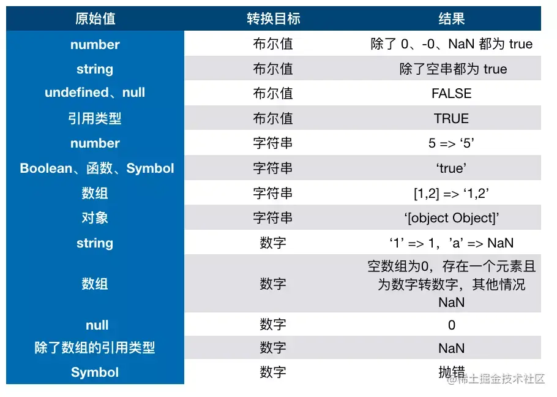

# 数据类型

## 目录

- [原生类型](#原生类型)
  - [原始类型：变量存储的是值，存储在 stack 里](#原始类型变量存储的是值存储在stack里)
  - [引用类型：变量存储的是地址，存储在堆里](#引用类型变量存储的是地址存储在堆里)
- [类型判断](#类型判断)
  - [typeof](#typeof)
  - [Instanceof（精确判断 object 是哪个类型）](#Instanceof精确判断object是哪个类型)
  - [Object.prototype.toString()（无法判断 object object 的区别）](#ObjectprototypetoString无法判断object-object的区别)
  - [Object.is](#Objectis)
- [类型转换](#类型转换)
  - [隐式类型转换](#隐式类型转换)

## 原生类型

#### 原始类型：变量存储的是值，存储在 stack 里

- boolean
- string
- number（0.1+0.2 转换为二进制是无限循环的所以无法得到 0.3，可以设置误差，转为大的整数、高精度计算库(其实就是转成整数）或者 tofixed 来解决）
- null（null 不是对象，虽然 null32 位为全 0 早期 js 用前三位 0 判断 object）
- undefined
- symbol
- bigint（由于 js 的 number 有 safe max 的限制，无法表示大数，一般用 bigint 来操作，和 number 不严格相等，不可和 number 混加）

原始值本身是不可变的，可变的是赋值的变量，当我们调用原始值的各种方法的时候，实际语言会创建一个包装对象，再调用对象的方法，然后再销毁临时对象

```javascript
"foo".includes("f") 隐式创建了一个 String 包装对象，并在该对象上调用 String.prototype.includes()
```

#### 引用类型：变量存储的是地址，存储在堆里

- Object
- Array
- Function
- Math
- Date
- RegExp

## 类型判断

### typeof

用来判断基础类型，除了 null 是 object 其他的都有对应的

### Instanceof（精确判断 object 是哪个类型）

用来判断 object 类型，会根据原型链上的类型是否存在，只要有就是 true

### Object.prototype.toString()（无法判断 object object 的区别）

基本 js 的内置对象都可以判断出来，格式类似 \[object Array] &#x20;

### Object.is

在===的基础上，修复了几个 bug（主要用于值比较）

```javascript
function is(x, y) {
  if (x === y) {
    //运行到1/x === 1/y的时候x和y都为0，但是1/+0 = +Infinity， 1/-0 = -Infinity, 是不一样的
    return x !== 0 || y !== 0 || 1 / x === 1 / y;
  } else {
    //NaN===NaN是false,这是不对的，我们在这里做一个拦截，x !== x，那么一定是 NaN, y 同理
    //两个都是NaN的时候返回true
    return x !== x && y !== y;
  }

```

## 类型转换

双转的规则



细节：

其他转布尔：数字三种，空字符串+两个未定义 6 个情况为 false，其他均为 true

其他转数字：

- 字符串带英文等不能转就是 NaN，其他会忽略前置的 0，0x 开头是 16 进制
- null 和 false 是+0

其他转字符：

对应的都是直接变字符，数字的 Infinity 和 NaN 会直接转成"NaN"这样

其他转对象：

通过基本类型的构造函数转换为包装对象

对象转其他：

- 优先调用 Symbol.toPrimitive()，判断是字符还是数字，字符则先 tostring 再 valueof，数字相反。如果都不是则先调用 ToPrimitive 方法转成原始值，这个方法有两个参数，一个是要转的值，一个是类型（如果不传除了日期是 stirng 其他都为 number）转不成原始值则会报错
- 所以当使用双等时，一个是对象另一个不是，则不会指定 hint 参数，那么默认都会先走 valueof
- 日期的 toString 会返回日期格式，fucniton 返回源码，数组则会拼装每一个元素用逗号链接，日期的 valueof 会返回毫秒
- 当 JavaScript 在进行某些操作时，如果传递给`ToPrimitive`的`hint`（提示信息）是`"string"`，那么会先调用`toString`方法。这种情况通常出现在字符串连接操作中。例如，当一个对象和一个字符串进行`+`操作时或者直接使用 string 和 number 构造函数将对象进行转换，会优先将对象转换为字符串，此时`ToPrimitive`会先调用`toString`。\[] == !\[] 就是因为这个机制最后两边都是 0
- 如何让 a == 1 && a == 2 成立？修改 valueof 函数，判断完+1 即可

```javascript
var a = {
  value: 0,
  valueOf: function () {
    this.value++;
    return this.value;
  },
};
```

Json.Stringfy 相当于 tostring，第二个参数 replacer，可以通过返回值控制哪些值需要处理

- 基础类型会转成对应的值
- undefined，函数以及 symbol 值会被忽略
- 如果对象有 toJSON 方法，则 stringfy 的是 tojson 方法的返回值而不是对象本身

双等的转换顺序：

- **如果两个操作数类型相同**
  - 则不进行类型转换，直接比较值。例如，`5 == 5`（两个都是`number`类型），直接比较就返回`true`；`'hello' == 'hello'`（两个都是`string`类型）也返回`true`。
- **如果一个操作数是**\*\*`null`\***\*，另一个是\*\***`undefined`\*\*
  - 它们被认为是相等的，即`null == undefined`返回`true`。
- **如果一个操作数是数字，另一个是字符串**
  - 将字符串转换为数字，然后进行比较。例如，`5 == '5'`，会把`'5'`转换为数字`5`，然后比较，结果返回`true`。
- **如果一个操作数是布尔值**
  - 将布尔值转换为数字（`true`转换为`1`，`false`转换为`0`），然后进行比较。例如，`true == 1`会返回`true`，因为`true`被转换为`1`后和`1`比较相等；`false == 0`也返回`true`。
- **如果一个操作数是对象，另一个不是**
  - 首先调用对象的`valueOf()`方法，如果返回值是原始类型，就用返回的原始类型值和另一个操作数进行比较；如果`valueOf()`返回的不是原始类型，就调用对象的`toString()`方法，用返回的字符串值和另一个操作数进行比较。
    - 例如，对于`new String('5') == 5`，`new String('5')`的`valueOf()`返回字符串`'5'`，然后将`'5'`转换为数字`5`和另一个操作数`5`比较，结果返回`true`。
- **特殊情况**
  - `NaN`（不是一个数字）与任何值（包括它自己）进行`==`比较都返回`false`。例如，`NaN == NaN`返回`false`。

### 隐式类型转换

单用+号，则会调用 tonumber 方法即 Number(xx)，如果是 object 则会进行 toPrimitive

加减乘除，两边同时 toPrimitive，如果有一个是字符就是字符拼接，否则就是数字相加
